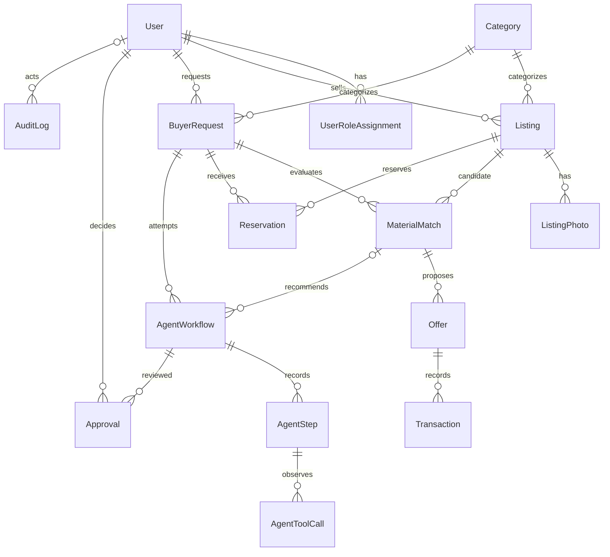

# Implemented entity relationships

Names below refer to current EF entities. `Listing` maps to Listings, `BuyerRequest` to MaterialRequests, `MaterialMatch` to Matches, and `Category` to Categories.

Role assignments have a composite (UserId, Role) key; email/category names and request/listing match pairs have unique indexes. Offer and Transaction each reference buyer and seller separately and enforce different counterparties. Reservations are correlated to transactions through the offer's match and its listing/request; there is no direct Transaction.ReservationId column. AuditLog uses entity type and ID rather than a foreign key to each domain table. The older Workflow entity/table remains for migration compatibility; new orchestration uses AgentWorkflow only. Constraints and indexes are defined in MarketplaceModelConfiguration and the committed migrations.
